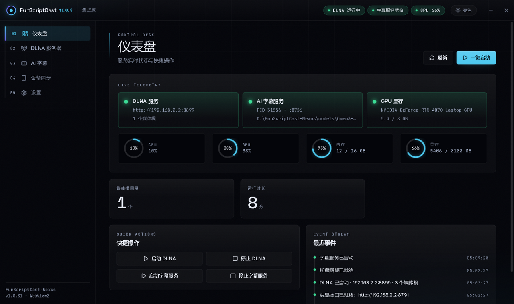
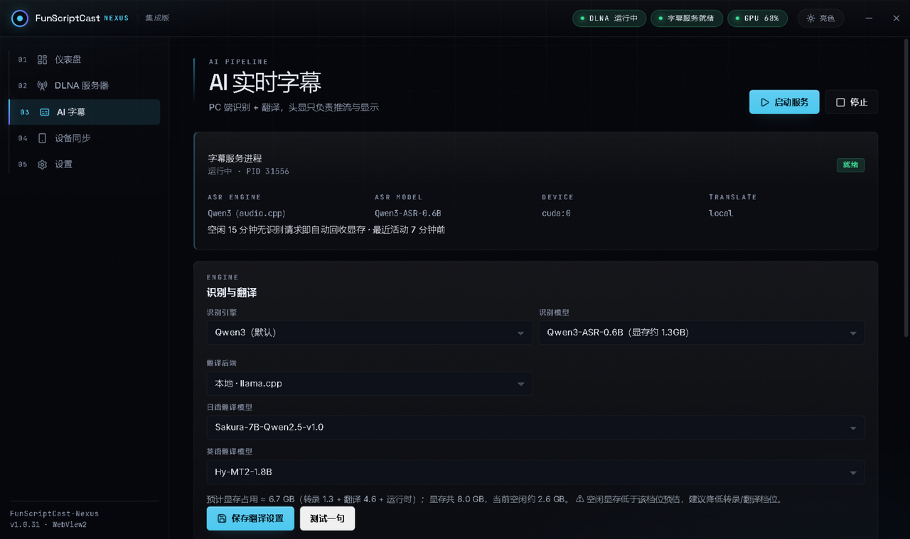
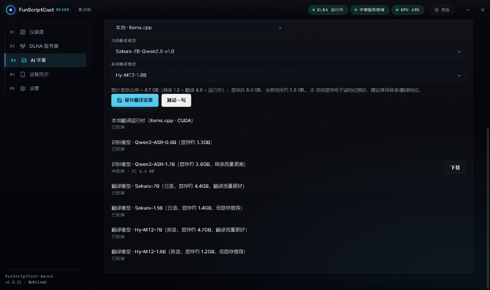
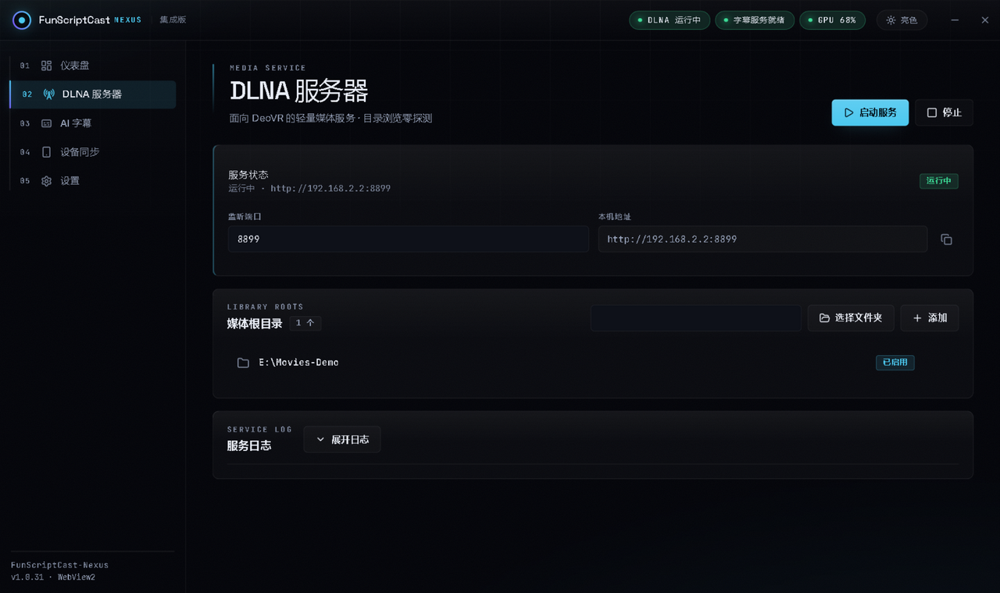
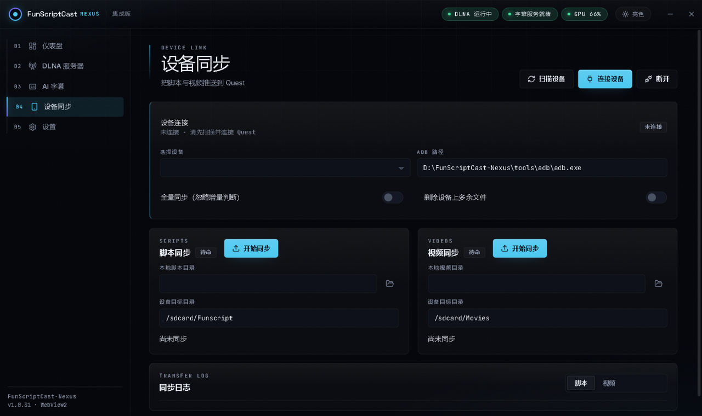

# FunScriptCast-Nexus

本项目由我个人借助 AI 工具开发。个人精力的付出、AI 工具的使用都有成本，而项目**免费**提供给大家使用。

欢迎大家体验，并提出 **BUG 反馈、功能需求、优化建议**。也欢迎大家投喂白饭给大肥鱼，助力项目开发。

  

**沟通渠道**：QQ `2831691505`
---
面向 VR 观影的 PC 端控制中枢：**DLNA 媒体服务 + AI 实时字幕 + 设备同步**。

- 下载安装包：[Releases](https://github.com/wanfneg/FunScriptCast-Nexus/releases/latest)（Windows 10/11 x64，约 80MB，识别运行时已内置）
- 源码即本仓库（公开），构建与开发说明见文末

## 快速上手：四步出字幕

**① 安装** —— 下载 `FunScriptCast-Nexus-Setup-*.exe`，向导里选安装目录。
**选空间充足的盘**（模型以十 GB 计），C 盘一个字节都不落。

**② 添加媒体库** —— 「DLNA 服务器」页添加你的视频目录，服务自动启动。
头显 / 播放器（DeoVR 等）在同一局域网里会自动发现设备 **FunScriptCast-DLNA**，
视频外挂的同名 .srt/.ass 字幕也能直接切换。

**③ 下载模型** —— 「AI 字幕」页的模型列表里点「下载」：
至少一个**识别模型**（0.6B 够用，1.7B 质量更高），再加一个**翻译模型**
（看日语片选 Sakura，英语片选 Hy-MT2；每个都有低显存和高画质两档）。下载支持断点续传。

**④ 开字幕** —— 「AI 字幕」页点「启动服务」，状态变**就绪**即可。
播放器正常播放，中文字幕自动上屏；PC 端空闲 5 分钟（可调）自动回收显存，下次播放自动再起。

## 功能一览

### AI 实时字幕

- **识别**：Qwen3-ASR 本地常驻推理，支持日语 / 英语；识别运行时（CPU 版）已内置安装包，
  NVIDIA 显卡用户可切 CUDA 提速。
- **混合切句**：静音定界 + 语音检测赋时，按整句出字，时间戳贴近说话时刻；
  长句还有**渐进出字**（临时稿先上屏、定稿自动覆盖），追得上节奏。
- **翻译**：本地 llama.cpp 承载，**按片源语言自动路由**——日语走 Sakura 系、英语走
  Hy-MT2 系，热切换无需重启；启动时自动预热，首句字幕不等模型冷启动。
- **翻译后端可换**：本地 llama.cpp 之外还有 Ollama、云端 OpenAI 兼容 API 可选；
  「测试一句」会真翻一句给你看，直连译文 / 管线译文 / 上游原始报错三段分明，
  key 错、余额不足、模型名错一眼可辨。

### 模型中心

| 类别 | 条目 | 显存约 | 说明 |
|---|---|---|---|
| 识别 | Qwen3-ASR-0.6B | 1.3GB | 默认档，速度质量均衡 |
| 识别 | Qwen3-ASR-1.7B | 3.6GB | 转录质量更高（官方分片权重下载后自动合并） |
| 日语翻译 | Sakura-7B / 1.5B | 4.4 / 1.4GB | 7B 质量更好，1.5B 低显存推荐 |
| 英语翻译 | Hy-MT2-7B / 1.8B | 4.7 / 1.2GB | 7B 质量更好，1.8B 低显存推荐 |
| 运行时 | llama.cpp（CUDA） | — | 本地翻译必需，下载列表一键获取 |

- 下载列表带**状态与进度**（已安装 / 未安装 / 百分比），装完自动接好配置。
- 「识别与翻译」卡实时显示**显存预算**（识别 + 翻译 + 运行时），空闲不足会提示降档，
  8GB 卡也能安心选组合。

### DLNA 媒体服务

- SSDP 自动发现 + UPnP 目录浏览，**DeoVR 兼容**（UTF-8 中文文件名不乱码）。
- 视频同目录的外挂字幕（.srt / .ass / .vtt）播放时可直接切换。
- 媒体根目录随便加几个盘；路径带引号/空格自动规整。

### 设备同步

- 脚本（.funscript）与视频经 adb **增量同步**到 Quest / 安卓手机，
  只推新增与变更文件，进度与结果在传输日志里可查。

## 常见问题

| 现象 | 处置 |
|---|---|
| 显存不够 / 提示降档 | 翻译换低显存档（Sakura-1.5B / Hy-MT2-1.8B），或把识别换回 0.6B |
| 首句字幕特别慢 | 多为服务刚启动的一次性成本（模型加载 + 预热），之后正常 |
| 播放没有字幕 | 仪表盘看「AI 字幕服务」是否就绪；模型未安装会在下载列表标出 |
| 下载中断 | 直接重试，断点续传接着下 |
| 想彻底重来 | 关程序后删安装目录里的 `data\`，即恢复出厂（模型不受影响） |

## 数据与升级

- 你的全部数据（配置 / 模型 / 日志）都在安装目录里：`data\`（几十 KB，含云端 key 与设置）、
  `models\`、`logs\`。**C 盘零写入**。
- 升级 = 直接装新包：只覆盖程序文件，`data\` 与 `models\` 一律不碰。
- 备份换机：拷走 `data\` 即可，模型可重新下载。

## 给开发者

- 字幕服务跑的是 `vendor\subtitle` 快照：改代码后 `tools\sync_distapp.ps1` 同步；
  改 `host_server.py` 须 `build\build_exe.ps1` 重编。构建前 `adb kill-server`。
- 运行测试：`tests\test_pipeline_unit.py`（管线 17 项）、`tests\test_merge_shards.py`（分片合并）。
- 架构、协议与排障史：[docs/AI-SUBTITLE-STATUS.md](docs/AI-SUBTITLE-STATUS.md)。
- 第三方组件与许可证台账：[docs/THIRD-PARTY-NOTICES.md](docs/THIRD-PARTY-NOTICES.md)（发行物不含 GPL 组件）。
