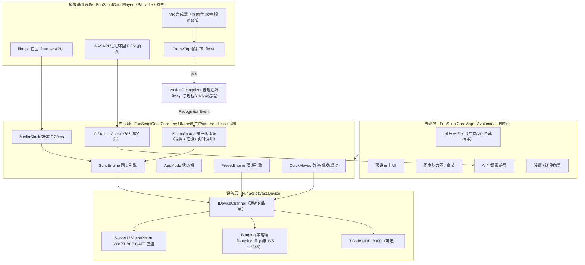
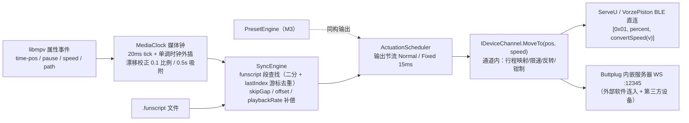
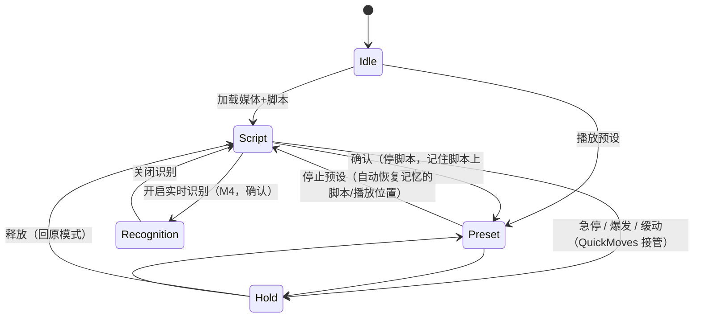
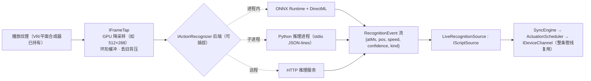

# FunScriptCast Central 开发方案

- 版本：v1.0（2026-09-29）
- 阅读对象：本项目工程师、生态其他端（Nexus / VR / 手机端）维护者
- 证据基础：本文所有"证据"引用均出自《[调研报告](调研报告.md)》（下称"调研 §x.y"）；调研材料与冲突处以证据为准并明说取舍。
- 立项一句话：用**内置视频播放器的时间轴直接驱动设备**，取代原 ServeU Central 六套外部播放器 IPC；带 VR 模式与 AI 字幕，移植手机端 24 预设系统，并为实时动作识别预留扩展。

---

## 0. 一页结论（TL;DR）

| 决策点 | 选定 | 一句话理由 |
|---|---|---|
| 技术栈 | **.NET 10 (LTS) + Avalonia 11 + libmpv(render API 嵌入)** | 原端同栈生态延续；Buttplug/WinRT BLE/.NET 互操作全部有实证（调研 §1.1） |
| 内置播放器 | **libmpv 嵌入自渲染**（GL 纹理 → 自绘合成） | 唯一同时满足"编解码全、硬解成熟、帧纹理可取（VR + 动作识别）、libass 内建"的引擎（§4.1） |
| 设备控制 | **自有 BLE 私有协议直连为主通道 + Buttplug 兼容层为出口** | 私有命令（临时限位/狂暴/A10/OTA）Buttplug 通用消息表达不了（调研 §5.1）；原端实证 buttplug_ffi.dll 可内嵌（§1.5） |
| 联动核心 | 播放器属性事件 → **20ms 媒体钟** → funscript 段查找（lastIndex 去重）→ `IDeviceChannel.MoveTo`，全进程内事件、零 IPC | 算法照抄手机端 SyncEngine（调研 §2.3），去掉全部外部播放器环节 |
| AI 字幕 | **对接 Nexus :8756/:8791，契约零改动**；桌面端自研 WASAPI 进程环回 PCM 抽头 | 三端契约已实现并对齐（调研 §3.3）；内置化工作量大且不解决固有延迟（§6.1） |
| 预设 | **手机端 PresetDefs 24 预设转 JSON 资源 + C# 引擎移植**，保留绝对速度语义 | 唯一权威实现、纯数据纯算法零 Android 依赖（调研 §2.4） |
| 动作识别 | 预留 `IFrameTap` + `IActionRecognizer` 可插拔后端，识别输出走 `IScriptSource` 合成实时脚本，复用整条联动管线 | 与静态 funscript 同构，M4 才落地、M1 起接口定型（§8） |
| 里程碑 | M1 播放+联动 → M2 VR+AI 字幕+兼容出口 → M3 预设+设备完善 → M4 动作识别实验 | §10 |

---

## 1. 背景与目标

### 1.1 重构动机（证据）

原桌面端 ServeU Central 自身不播视频，靠六套异构 IPC 跟踪外部播放器（调研 §1.3）：PotPlayer 窗口消息轮询、MPV 命名管道、DeoVR TCP 心跳、OFS、WMP COM、纯脚本。每接入一种播放器都要单独适配，且实证了断连刷屏、热键注册崩溃、WiFi 明文等问题（`2026-08-14.log`、`2026-09-29.log`）。手机端已证明"内置播放器 + PlayerLink 同构抽象"的同步引擎对内置/外部播放器完全同构（调研 §2.3）——新桌面端把这条路搬到 PC：**播放器在本进程内，时间轴即事件源，不存在 IPC**。

### 1.2 目标 / 非目标

**目标**：

1. 内置播放器（平面 + VR 模式）承担全部视频播放；播放器时间轴驱动 funscript 同步与预设模式；
2. ServeU / VorzePiston 设备直连（私有 BLE 协议），保留 Buttplug 兼容出口（外部软件可连入）；
3. AI 字幕对接 Nexus，契约不变；
4. 移植 24 预设系统并支持用户自定义；
5. 架构预留实时动作识别联动；
6. 原端配置与数据平滑迁移。

**非目标（明确不做）**：

- 不做原端六媒体源兼容（内置播放器取代；老用户中原端 Buttplug/TCode 出口继续可用，第三方前端如 ScriptPlayer 可连入本项目）；
- 不做移动端/头显端功能复制（手机、Quest 各有其端）；
- 不做云端媒体库/Nexus 改造（8756/8791/8899 服务端零改动）；
- M1-M4 不承诺头显（SteamVR/OpenXR）视频输出——桌面"VR 模式"指窗口内球面/鱼眼渲染（与手机端 VR 模式同义，调研 §2.2）。

---

## 2. 总体架构

### 2.1 模块划分



分层铁律：

- **Core 不引用任何 UI 与原生库**；时间经 `IClockSource` 注入，可用仿真时钟 headless 回放测试（同步/预设引擎是本项目算法核心，必须可单测）；
- **PlayerInfra 是唯一碰原生（mpv/WASAPI/GL）的程序集**；对 Core 只暴露托管接口与事件流；
- **DeviceLayer 对上只有 `IDeviceChannel`**：行程映射、限速、反转、钳制全部在通道内部（手机端分层，调研 §2.4 值得复用设计⑤）；
- UI 通过 CommunityToolkit.Mvvm（原端同款，调研 §1.1）绑定 Core 状态流，UI 可整体替换不影响核心。

### 2.2 进程 / 线程模型

| 线程 | 职责 | 备注 |
|---|---|---|
| UI 线程（Avalonia） | 视图渲染、ViewModel、AI 字幕 overlay | 不做任何同步/网络工作 |
| 渲染线程（GL 上下文） | mpv render update、VR mesh 绘制、（M4）FrameTap GPU 降采样 blit | ANGLE(GL ES→D3D11)，与原端渲染栈同路径（调研 §1.1） |
| 时钟/联动线程 | MediaClock 20ms tick、SyncEngine、PresetEngine 循环 | 对齐手机端 LOOP_INTERVAL_MS=20 与独立 scope（调研 §2.3/§2.4） |
| IO 线程池 | 字幕 HTTP 上传、BLE 写队列、配置 | BLE 写失败保留索引重试（手机端语义） |
| （M4）推理子进程 | 动作识别模型 | 默认进程外，绝不阻塞渲染/联动 |

### 2.3 计划目录结构（本文档阶段不创建代码）

```
FunScriptCast-Central/
  FunScriptCastCentral.sln
  src/
    FunScriptCast.Core/          # 领域：时钟/脚本/同步/预设/字幕客户端/状态机/契约
    FunScriptCast.Player/        # libmpv 宿主、VR 合成器、WASAPI 抽头、IFrameTap
    FunScriptCast.Device/        # IDeviceChannel、ServeU/Vorze WinRT BLE、buttplug_ffi/TCode
    FunScriptCast.Recognition/   # M4：识别接口与后端适配（M1 起仅接口随 Core 定型）
    FunScriptCast.App/           # Avalonia UI、DI 组装、配置与迁移
  tests/
    FunScriptCast.Core.Tests/    # 时钟/同步/预设 headless 单测（仿真时钟 + 录制回放）
  docs/
```

---

## 3. 技术栈选型（任务 a）

### 3.1 主框架对比

| 维度 | **A. .NET 10 + Avalonia（选定）** | B. Tauri/Electron + Web 前端 | C. Qt 6/QML | D. Kotlin Compose Desktop |
|---|---|---|---|---|
| 生态延续 | 原端同栈（.NET 10.0.2 + Avalonia 11.3.11，调研 §1.1）；配置迁移同语言；团队有 mpv/Avalonia 实战痕迹 | 可复用网页端 Vue/Vuetify 资产（调研 §4.1） | 无既有资产 | 手机端 Kotlin 代码（PresetDefs/DeviceProtocols/SyncEngine）可原样编译 |
| 视频播放 | libmpv P/Invoke 成熟（mpv.net 等先例；原端已做过 mpv 管道 IPC，调研 §1.3）；VR 帧纹理自绘可控 | WebView2 无 Web Bluetooth/PCM 抽头受限；HEVC/高分辨率受浏览器沙箱限制 | libmpv 集成成熟 | JVM 无成熟嵌入引擎（vlcj/ffmpeg 绑定弱），VR 渲染困难 |
| 设备控制 | WinRT BLE GATT 原端实证（BluetoothService，调研 §1.1）；buttplug_ffi.dll P/Invoke 原端实证 | 需 Rust 原生插件自研全套 | QtBluetooth Windows 支持一般 | Windows 上 JVM BLE 栈不可靠（手机端协议代码再对也没法跑） |
| 预设资产 | 数据转 JSON + 算法 C# 重写（约 200 行，见 §7） | JS 重写 | C++ 重写 | **原样拷贝** |
| UI 效率 | FluentAvalonia/CommunityToolkit.Mvvm 原端验证过 | 生态最大 | 性能好但全新 | Compose Desktop 桌面生态弱 |
| 主要风险 | libmpv 许可（§3.3）；自绘 VR 复杂度 | 设备/音频/原生能力全是硬伤 | 全新技术栈无证据 | 播放器与 VR 两项核心不可行 → 整体否决 |

**结论：选 A。** D 的预设代码复用优势救不了播放器/VR/BLE 三个核心不可行项；B 在设备直连与音频抽头上直接撞墙（Web Bluetooth 仅 Chromium 系浏览器且 WebView2 不支持，调研 §4.5）；C 无生态证据。A 唯一关键复用损失是手机端 Kotlin 算法需重写——但全部为小文件纯算法（PresetDefs 467 行 / PresetPlayer 158 行 / Funscript/SyncEngine 核心），且重写时同步建立 headless 单测（手机端没做到的）。

### 3.2 核心库清单

| 用途 | 选型 | 许可 | 证据/理由 |
|---|---|---|---|
| UI | Avalonia 11.3 + FluentAvalonia + Lucide.Avalonia | MIT | 原端 11.3.11（调研 §1.1） |
| MVVM/DI/JSON | CommunityToolkit.Mvvm + Microsoft.Extensions.DependencyInjection + System.Text.Json | MIT | 原端同款组合 |
| 视频 | **libmpv（LGPL 构建动态链接，见 §3.3）** | LGPL-2.1-or-later（LGPL 构建）/ GPLv2+（默认构建） | §4 选型 |
| 自有设备 BLE | Microsoft.Windows.SDK.NET（CsWinRT）投影 WinRT Bluetooth LE GATT | MIT | 原端 BluetoothService 同路径（调研 §1.1） |
| Buttplug 生态 | buttplug_ffi.dll P/Invoke（原端 9 导出契约：server_create/start/stop/destroy、server_add_device、server_set_command/connect/disconnect_callback + 回调签名） | Buttplug BSD-3 | 原端实证 WS 127.0.0.1:12345（调研 §1.5） |
| 音频抽头 | WASAPI Process Loopback（OS API，self-process） | — | §6.2 |
| 日志/崩溃 | NLog + 本地 ErrorReports（格式延续原端：App Version/Framework/Avalonia Version/匿名 ID） | MIT | 调研 §1.5 |
| 自动更新 | NetSparkle appcast（检查端点可与 serveu.fun 云端契约对接，调研 §4.4） | MIT | 原端同款 |
| 推理（M4） | ONNX Runtime + DirectML（进程内）或 Python 子进程 | MIT | §8 |

运行时锁定 **.NET 10 LTS**（与原端 10.0.2 同大版本，支持期至 2028-11，避免 M1 开工即撞 .NET 8 LTS 2026-11 到期）。

### 3.3 许可决策（关键风险，前置处理）

libmpv 默认构建为 GPLv2+，但 mpv 官方支持 `-Dgpl=false` 的 **LGPL 构建**（裁剪 GPL 组件，动态链接下闭源商用可行）。原端是带 SUL1 许可的商业产品（调研 §1.2）。本项目的取舍：

- **M1 第 1 周做"LGPL 构建 + render API + 动态链接"PoC**，验证功能裁剪（重点是 libass 是否随 LGPL 构建保留——libass 本身 ISC 许可，mpv LGPL 构建保留 libass 支持）不影响字幕方案；
- PoC 通过 → 闭源路线可行，应用按商业许可分发；PoC 不通过（功能损失不可接受）→ 二选一：应用整体以 GPLv2+ 开源，或改用 libVLC（LGPL，§4.1 备选）重评估。**此决策必须在 M1 排期前完成**，因为它影响引擎选型闭环。

---

## 4. 内置播放器（任务 b）

### 4.1 引擎选型

| 候选 | 编解码/硬解 | 嵌入与帧访问 | 字幕 | 许可 | 结论 |
|---|---|---|---|---|---|
| **libmpv render API（选定）** | FFmpeg 全家桶；D3D11VA/DXVA2 硬解成熟（`hwdec=auto-safe`） | GL 纹理级输出（我们持有渲染循环 → 平面直接呈现、VR 自绘 mesh、M4 帧抽取同一入口）；`observe_property` 帧精度时间轴事件 | libass 内建（srt/ass 全支持） | 见 §3.3 | **选定**：唯一同时满足帧纹理可取 + 硬解 + 字幕 + 团队 mpv 经验 |
| FFmpeg 直接集成 | 全能但 demux/解码/音视频同步/字幕全要自研 | 完全可控 | 需自接 libass | LGPL | 工作量约 10 倍，否决；仅用作音频旁路解码（§6.2 备选） |
| libVLC | 硬解好 | 视频回调可拿帧，但时间轴观察模型弱 | 字幕能力一般 | LGPL | **备选**（§3.3 PoC 失败时的 Plan B） |
| WebView2 + HTML5/WebCodecs | 容器/编码受限，HEVC 依赖系统 | VR 需 WebGL；PCM 抽头困难 | track | WebView2 运行时 | 联动延迟与原生能力不足，否决 |
| GStreamer | 能力强 | appsink 可拿帧 | 需拼装 | LGPL | Windows 分发复杂，无生态证据，否决 |

### 4.2 libmpv 嵌入设计

```csharp
// FunScriptCast.Player：对 Core 暴露的播放器抽象（语义对齐手机端 PlayerLink，调研 §2.3）
public interface IPlayerEngine : IObservable<PlayerState>   // 事件流：position/isPlaying/speed/duration/mediaPath
{
    PlayerState State { get; }
    void Load(string pathOrUrl);                             // 本地文件 / http(s) URL
    void PlayPause(); void Seek(TimeSpan to); void SetSpeed(double rate);
    IDisposable Observe(string mpvProperty, Action<string> onValue);
}
```

实现要点：

- **初始化**：`vo=libmpv`、`hwdec=auto-safe`、`audio-pitch-correction=yes`（变速不改音高，联动速度补偿一致性更好）、`keep-open=yes`（片尾不销毁上下文）。
- **时间轴**：`observe_property` 订阅 `time-pos`、`pause`、`speed`、`duration`、`path`、`demuxer-cache-state`。time-pos 事件驱动 MediaClock 锚点（§5.2），tick 之间用单调时钟 + speed 外插——比原端 PotPlayer 窗口轮询（调研 §1.3）延迟低一个量级且无窗口依赖。
- **双向控制**：`seek`/`pause`/`set speed` 命令走 mpv command API（进程内调用，无管道）。
- **渲染宿主**：Avalonia `NativeControlHost` 建 GL（ANGLE）子上下文，每帧 `mpv_render_context_render` 到 FBO 纹理，再按模式合成（平面：直接全屏 quad；VR：采样到 mesh）。与原端 ANGLE 渲染栈同路径（调研 §1.1）。
- **性能预算**：1080p/4K H.264/HEVC D3D11VA 零拷贝互操作为目标；8K AV1 若互操作开销超预算则回退 GPU 拷贝路径，再不行限制 8K 软解提示（M2 PoC 项）。

### 4.3 VR 视频模式

格式枚举对齐手机端（球面/180°/鱼眼/平面/3D 左右/上下，调研 §2.2），预留与 VR 端"投影 7 种/立体 4 种"（调研 §3.2）的全集对齐：

```csharp
public enum VideoProjection { Flat, Equirectangular360, Hemisphere180, Fisheye180, Fisheye220 /* M2 对齐 VR 端全集时扩展 */ }
public enum StereoLayout { Mono, SideBySide, TopBottom }   // SBS: uv.x*0.5(+0.5 右眼)；TB: uv.y*0.5
```

- **渲染**：mpv 输出视频纹理 → 投影 mesh 采样。equirect 球体（经纬分段如 48×24）、180° 半球、鱼眼 dome；mesh 顶点静态生成、视口投影由相机矩阵控制。
- **视角交互**：鼠标/触摸拖拽 = yaw/pitch；滚轮 = FOV 60°-120°；键盘/手柄右摇杆同义；双击复位视角。与手机端"陀螺仪+触摸视角"等价（PC 无陀螺仪，桌面以指针为主）。
- **字幕在 VR 模式下的处理**：libass 字幕由 mpv 渲染进视频纹理（随球面弯曲，可接受）；AI 字幕 overlay 在 UI 层（窗口固定位置，等效 VR 端"头锁定 Canvas"的桌面简化，调研 §3.2）。
- **头显输出预留**：合成器接口 `IOutputTarget { FlatWindow, VrWindow }`；OpenXR/SteamVR 立体目镜输出列为 backlog（非目标，§1.2），接口形状在 M2 定稿以免返工。

### 4.4 字幕渲染

| 层 | 方案 | 说明 |
|---|---|---|
| 字幕文件（srt/ass/ssa/vtt） | mpv `sub-add` + libass | 编解码、样式、定位全由 libass；与手机端支持格式一致（调研 §2.2） |
| AI 字幕 | Avalonia overlay 控件，绑定 `SubtitleDisplay.CurrentLine` 状态流 | 渲染与视频链路解耦，样式可控（§6.4） |
| 互斥规则 | AI 字幕开启时 `sub-select=no` 并提示；关闭恢复 | 沿用手机端"AI 字幕与文件字幕互斥"语义（调研 §2.2/§2.6），避免双行叠加 |

### 4.5 M1 播放器验收 PoC（开工首两周）

1. LGPL 构建 libmpv + render API 进 Avalonia GL 控件，1080p/4K 播放、硬解生效（`hwdec` 属性回读）；
2. `observe_property(time-pos)` 事件粒度测量（目标 ≥ 30Hz 或按需插值）；
3. seek/变速往返后时间轴单调性（联动正确性的地基）。

---

## 5. 联动核心（任务 c）

### 5.1 事件管线



与原端的本质差别：原端"外部播放器 → IPC → 进度 → 设备"共 3 段跨进程链路（调研 §1.3），本项目全部在进程内，唯一外部边界是 BLE 无线本身。

### 5.2 MediaClock（媒体钟）

```csharp
public sealed class MediaClock
{
    // 锚点 = 播放器上报 (position, 单调时刻, isPlaying, speed)
    // 每 20ms：mediaTime = anchor + (now - anchorAt) × speed（播放中）
    // 新锚点到达：|偏差| < 500ms → 按 0.1 比例平滑；≥ 500ms → 直接吸附
    // 20ms 循环与双阈值均照抄手机端 SyncEngine（调研 §2.3，LOOP_INTERVAL_MS=20）
}
```

`IClockSource` 注入单调时钟（`Stopwatch.GetTimestamp()`），测试用仿真时钟驱动。

### 5.3 funscript 解析与同步（规格照抄，注明出处）

- **解析**：`actions[].at`(ms) / `pos`(0-100)；防 NaN、排序；与三端一致（手机端 `Funscript.kt:61-79`、网页端 funscript-utils、VR 端同源，调研 §5.2）。CSV/JSON 导入沿用网页端三格式语义（.funscript/.json/.csv，调研 §4.2）。
- **段查找**：`t = mediaTime + offsetMs` → 二分定位段 → `speed = |Δpos| × 100 / dt`（dt 为相邻 action 时间差）；**lastIndex 游标去重**：段索引变化才发帧（手机端 `SyncEngine.kt:296-320`）。
- **变速补偿**：`speed ×= playbackRate`（网页端实证 `Math.round(speed*this.playbackRate)`，调研 §4.2）。
- **skipGap**：加载时预计算无动作段（超过 `gapDurationSec` 的间隔），播放进入即 seek 段尾并换算回媒体时间坐标（手机端 `SyncEngine.kt:139-201`）。默认值取原端 GapDuration 60.3s（配置迁移，§9.4），新装默认对齐手机端 60s（调研 §2.2）。
- **输出节流**：Normal（段变化即发）/ Fixed（15ms 固定间隔）双模式，沿用原端 ScriptMode 语义（调研 §1.2）。
- **失败处理**：BLE 写失败保留段索引重试（手机端语义），连续失败 N 次进入设备断连状态并暂停发送。

### 5.4 设备控制层：Buttplug 的定位（对任务书的取舍说明）

任务书把设备控制标注为 "Buttplug.io"。调研证据表明：自有设备的**临时限位（0x42 帧）、狂暴 OC（MotorMaxPower）、A10 伪装、WiFi OTA（OWIFI/O 帧）都是私有命令**（调研 §5.1），Buttplug 通用消息（LinearCmd 等）表达不了；原端因此也是自有设备走 WinRT GATT 直写、Buttplug 服务器仅作对外出口（调研 §1.3）。**因此 Buttplug 在本架构中是"兼容层与生态入口"，不是自有设备的必经路径**：

| 维度 | 私有 BLE 直连（主通道） | 纯 Buttplug（Intiface/内嵌） |
|---|---|---|
| 私有功能（限位/OC/A10/OTA/电压温度） | 全支持 | 无法表达 |
| 延迟 | GATT 直写，最短路径 | 经 WS 序列化 + 通用设备抽象 |
| 第三方生态设备（Lovense 等） | 无 | 有 |
| 外部软件（ScriptPlayer 等）连入 | — | 内嵌服务器支持（原端实证 :12345） |
| 协议风险 | 帧级规格三端一致已固化（调研 §5.1） | 受 Buttplug 版本演进影响 |

实现：

```csharp
public interface IDeviceChannel : IDisposable
{
    string Id { get; }
    DeviceProfile Profile { get; }          // UUID/帧构造/能力，数据驱动（§9.3）
    ChannelState State { get; }             // 连接中/已连接/断连/出错
    void MoveTo(int positionPercent, int speed);  // 通道内完成 min..max 重映射、速度按行程缩放、上限钳制、反转
    void Stop();
    event Action<DeviceTelemetry>? Telemetry;     // 电压/温度/信号（原端 motorPower 等，调研 §1.2）
}
```

- **ServeU/VorzePiston 直连**：WinRT BLE GATT（扫描/连接/特征读写）+ 帧构造逐字节照抄 `DeviceProtocols.kt`（UUID、D0 握手、0x42 临时限位、0x01 运动帧、convertSpeed 分段表、A10/OC/OWIFI/O，调研 §5.1）；并发加固移植手机端模式：**连接代际号 + GATT 操作互斥锁 + 写回调单槽位**（BleDeviceService 980 行坑清单的教训，调研 §2.6）。20 字节分片 write-without-response、命令队列串行、应答超时 5s（网页端语义，调研 §4.2）。
- **Buttplug 兼容层**：P/Invoke 原端同款 buttplug_ffi.dll（9 导出契约，调研 §1.5）内嵌服务器，WS 127.0.0.1:12345（端口可配，与原端一致）；自有设备注册为 Buttplug 设备供外部客户端控制（原端日志实证模式）。另提供 Buttplug **客户端**模式连 Intiface Central，把第三方生态设备适配成 `IDeviceChannel`（M2+，配置开关）。
- **TCode UDP :8000**：可选保留原端服务器（`L0(\d+)`/`L0\d+S(\d+)`/`L0\d+I(\d+)` 解析，调研 §1.3），默认关闭。
- **设备清单数据驱动**：`DeviceProfile`（UUID 表、帧构造参数、能力位）存 JSON 配置而非硬编码——吸取三端硬编码 `Toys.all` 的教训（调研 §2.6/§3.2），新增"伪装 Xiaomi（FFF0/FFF2/FFF1）"等设备只改配置（规格见调研 §4.2）。

### 5.5 端到端延迟预算

| 环节 | 预算 | 依据 |
|---|---|---|
| mpv 解码→呈现 | 16-33ms（1-2 帧） | 显示管线固有 |
| time-pos 事件 + 20ms 插值 | ≤ 20ms | §5.2 |
| 段查找 + 调度 | ≤ 5ms | 内存操作 + 二分 |
| BLE write-without-response | ≤ 20ms | 单包 20 字节（调研 §4.2） |
| **可控合计目标** | **P95 ≤ 80ms** | M1 验收指标 |
| 设备机械响应 | 100-300ms | 机电固有，不在软件预算内；由脚本 offset（±10/±100ms，调研 §2.2）供用户补偿 |

### 5.6 脚本体验（UI 侧）

- 热力图 + 章节标记：沿用原端概念（HasHeat/bucketSize 按速度分色、章节悬停，调研 §1.2）+ 手机端交互（点击/拖动发跳转，调研 §2.2）。
- 脚本自动匹配三级规则：同目录同名 → 本地脚本文件夹（索引）→ 远程源（WebDAV/SMB/DLNA，backlog，M4，调研 §2.2）。

---

## 6. AI 字幕（任务 d）

### 6.1 对接 Nexus 还是内置化？

| 维度 | **对接 Nexus :8756/:8791（选定）** | 内置化（whisper.cpp/ONNX ASR 进本应用） |
|---|---|---|
| 复用 | 三端契约已实现并对齐（调研 §3.3）；手机端客户端的分块/上传/去重/显示逻辑整体移植（调研 §2.3） | 全新开发管线 + 模型管理 |
| 模型/翻译 | Nexus 模型中心（Qwen3-ASR + Sakura/Hy-MT2 路由、下载/回收）现成 | 需自建模型管理与双模型栈 |
| 延迟 | 固有 4-9s（块状识别，调研 §2.6），档位协商可调 | 或许略优，但仍是秒级，本质相同 |
| 风险 | 依赖 Nexus 运行；8756 单会话独占（调研 §3.1） | 工作量大、与 Nexus 双线维护、显存竞争 |
| 与头显/手机端一致性 | 同一后端 = 同一翻译风格 | 出现三端字幕不一致 |

**结论：对接 Nexus，服务端零改动。** 内置化不在 M1-M4 排期；若未来要做，走 §8 的推理后端插拔机制（与动作识别共用子进程基础设施），不另起炉灶。

### 6.2 桌面端音频采集（唯一没有现成代码的核心件）

手机端 PcmTapProcessor 深度绑定 media3 AudioSink（调研 §2.6），不可复用。候选：

| 方案 | 原理 | 优点 | 缺点 | 结论 |
|---|---|---|---|---|
| **A. WASAPI 进程环回** | `AUDIOCLIENT_ACTIVATION_TYPE_PROCESS_LOOPBACK`（Win10 19041+）捕获**本进程**音频树——libmpv 就在本进程输出 | 引擎无关（换引擎不动采集）；"听即所得"（用户听什么识别什么，含音轨切换）；不碰 mpv 内部 | 需 19041+；含本应用 UI 提示音（需静音策略）；PCM 时钟需与 MediaClock 对齐 | **主选**，M2 首个 PoC |
| B. 并行 FFmpeg 音频解码 | 旁路解码同一媒体音轨 → 混单 → 16kHz | 媒体时间戳精确；可离线预跑（未来"二刷秒出"缓存的基础——注意 Nexus 目前无持久化，调研 §3.1） | 双倍 IO；seek 跟随复杂 | **备选** + 远期 |
| C. mpv `--ao=pcm` 管道 | 输出 WAV 到管道 | 简单 | mpv 单 AO：与可听输出互斥，无法边听边采 | 否决 |
| D. 虚拟声卡 | 用户配置虚拟音频设备 | 通用 | 用户配置负担重、易错 | 否决 |

实现要点（A）：采集线程拿 IAudioCaptureClient → 混单 + 线性插值重采样 16kHz int16（对齐手机端，调研 §2.3）→ 写入与 MediaClock 联动的缓冲；**块起始时间戳取当前 mediaTime**（与手机端用播放位置给块定时的做法一致）。

### 6.3 客户端契约（逐条保留，出处见调研 §2.3/§3.3）

- 上传：`POST {url}/transcribe?lang=ja|en&video_start_ms=…&keep_from_ms=块起点+重叠/2&translate=true&partial=1`，body 裸 LE PCM（application/octet-stream），readTimeout 180s；
- 分块：默认 3s + 1s 重叠；`recommended_chunk_sec` clamp [3,30] 运行中切换，重叠 sec<3 取 min(1, sec/3)；每会话从 3s 起步；
- 背压：有界队列 8 块、落后播放 6s 判过期丢弃、5s 心跳日志；
- 鉴权：`X-FSC-Subtitle-Token` 附于 8756 全部请求；**令牌存储改用 Windows DPAPI（ProtectedData）加密落盘**——吸取原端 config.json WiFi 明文与手机端明文 cleartext 的教训（调研 §1.3/§2.6），不再重演；
- 模型就绪状态机：8756 主机推导 `http://host:8791`（非 8790）→ GET /api/headset/status（4s 超时）→ POST /api/subtitle/start（8s）→ 轮询 1.5s/次上限 90s → 就绪强制续播（含用户手动暂停场景）/失败只恢复自己按的暂停；连续 3 块上传失败判定模型被回收，自动重拉（120s 冷却）；
- 去重与显示：时间重叠 + LCS 去重（≥6 字且 ≥30%）；送达顺序显示队列 dwell = 1.2 + 0.1×字数，夹 [1.8, 5.5]s，上限 12 条，seek > 2s 清队；
- 会话代次（session++）守卫所有异步回调，防旧会话污染；
- 与文件字幕互斥（§4.4）。

已知限制（产品预期管理，写进用户文档）：字幕滞后画面约 4-9s 固有；云端翻译后端切 25s 大块时更长；Nexus 8756 单会话独占——桌面端开启 AI 字幕时若 8756 被头显占用应给出明确提示（探活即失败）。

### 6.4 字幕渲染

Avalonia overlay 控件（半透明底条、双行：识别文 + 中文译文），绑定显示队列的 CurrentLine 状态流；样式与手机端 currentLine StateFlow 渲染同构（调研 §2.3）。VR 模式下固定于窗口下方（§4.3）。

---

## 7. 预设模式（任务 e）

### 7.1 数据模型（手机端 PresetDefs 移植，规格出处：调研 §2.4）

24 个内置预设从 `PresetDefs.kt`（467 行）**机械转换为 JSON 嵌入资源**（`presets.builtin.json`），数据一字不改（含 previewFrom/previewTo 千分比窗口与来源注释）；算法 C# 重写：

```csharp
public sealed record PresetSegment(int Start, int End, int Speed, double? DurationMs = null);
public sealed record PresetKeyframe(int Pos, long AtMs);

public sealed record PresetDef(string Id, string Name,
    IReadOnlyList<PresetSegment>? Segments, IReadOnlyList<PresetKeyframe>? Keyframes,
    int PreviewFrom, int PreviewTo)
{
    public bool IsWaveform => Keyframes is { Count: > 0 };
    public IReadOnlyList<PresetSegment> PlaySegments { get; init; } = [];  // 加载时经 ToSegments() 归一化：
    // 相邻关键帧 = 一段，speed = 距离/时长，durationMs 记原始时间轴；durMs ≤ 0 除零给 1 兜底
    public int LoopTravel { get; init; }            // = Σ|End - Start|（一个循环总行程）
    public double LoopDurationMs(int speed) => LoopTravel * 1000.0 / speed;
    public bool HasFeltWindow => PreviewTo > PreviewFrom;
}
```

选 JSON 而非 C# 硬编码的理由：为 §7.4 用户自定义预设铺路（同一加载器）、可在不发版的情况下修数据；转换脚本一次性产出并与 `PresetDefs.kt` 做 diff 校验（24 条、关键字段全等）。

### 7.2 执行引擎（绝对速度语义，规格出处：调研 §2.4）

核心公式（三方同源：UI 配速标签 / 波形形状 / 播放节奏共用）：

- 速度滑杆（1-500）= 下发的 Units/s（绝对速度）；BOOST = 500，再钳设备 maxSpeed；
- `waitMs = naturalMs × 段原速 ÷ 实际速度`（等价于 行程 ÷ 实际速度；源时间轴只记在 durationMs）；
- `循环时长@速度 = LoopTravel × 1000 ÷ speed`（卡片「循环 Ns」标签实时变）。

```csharp
// FunScriptCast.Core.PresetEngine（伪代码，结构对齐 PresetPlayer.kt）
while (_playing)
{
    foreach (var seg in preset.PlaySegments)
    {
        int dist = Math.Abs(seg.End - seg.Start);
        if (dist > 0)
            foreach (var ch in _channels) ch.MoveTo(seg.End, EffectiveSpeed()); // 通道内钳制，引擎零设备知识
        long naturalMs = (long)(seg.DurationMs ?? dist * 1000.0 / seg.Speed);
        long waitMs = (long)(naturalMs * (double)seg.Speed / EffectiveSpeed());
        await WaitMonotonicTicks(waitMs, _cancel);   // 20ms tick 轮询 Stopwatch 单调时钟；切预设/停止立即中断
        // dist == 0 的保持段：只等待不发送（不发 0 速帧）
    }
    if (_randomMode) SelectRandomOtherThan(current); // 每循环换且不连续重复
}
```

- 独立后台线程（不对齐 UI 线程），对齐手机端"独立 scope 保后台节奏"（调研 §2.4 设计⑥⑦）；
- RANDOM 点开时播放中立即跳一个；BOOST 只覆盖速度、松开恢复记忆前值（500 不持久化）；
- 多通道发送：对所有已连接 `IDeviceChannel` 发送（手机端"双通道盲发"的推广；未连接通道自然不存在，静默语义相同）。

### 7.3 模式互斥：AppMode 状态机（改进手机端弹窗链）

手机端三模式互斥靠弹窗确认 + 停止预设后不自动恢复（调研 §2.6）。本项目以显式状态机收敛：



- 急停（allowMove=false 全通道停）/ 一键爆发（暂停脚本同步，min/max 交替 maxSpeed）/ 待机缓动（空闲 idleSec 后慢速往返，外部动作重置计时）——语义照抄手机端 QuickMoves（调研 §2.2）；
- 快捷动作与预设/脚本的模式切换全部经过状态机，禁止旁路直写设备（`IDeviceChannel` 写路径唯一经过 ActuationScheduler 仲裁）。

### 7.4 UI 与新增能力

- 三卡布局移植（设备行程双滑轨 / 预设两列网格 + 选中滚动定位 / 速度滑杆 + BOOST 红、播放蓝、RANDOM 绿三圆钮；权重 1.9/7.4/3.5，窄屏回退整页滚动）——形态出处调研 §2.4；
- 波形卡片绘制算法移植到 Avalonia `SKCanvas`：`x = 累计行程`（hasFeltWindow 时任何速度下形状一致）、previewFrom/To 千分比窗口、两端零点对齐、跨循环接缝点线、包络渐变填充；顶点序列按 PresetDef 缓存（拖滑杆 60-120Hz 不重算）；
- **新增（原端/手机端均无）**：用户自定义预设——`presets.user/` 目录 JSON（同一 schema），UI 支持导入/导出/复制内置预设为模板；这是 JSON 资源化的直接收益。

---

## 8. 实时动作识别联动预留（任务 f）

### 8.1 管线



设计原则：**识别不是新管线，而是新的 `IScriptSource`**。静态 funscript（文件）、预设、实时识别对下游完全同构——这是 §2.1 分层的直接收益，也是本节"预留"的实质：M1 定型 `IScriptSource` 与帧纹理出口，M4 只实现新源。

### 8.2 接口定义（M1 随 Core 定型，M4 实装）

```csharp
// 帧抽取（PlayerInfra 实现，渲染线程 GPU blit，零 CPU 拷贝路径优先）
public interface IFrameTap : IDisposable
{
    void Configure(FrameTapOptions o);            // fps(默认 5, 1-15)、宽高、像素格式
    IObservable<FrameBuffer> Frames { get; }      // FrameBuffer: 共享 GPU handle 或内存 + 媒体时间戳
}

// 推理后端（可插拔；默认子进程实现）
public interface IActionRecognizer : IDisposable
{
    RecognizerInfo Info { get; }                  // 名称/支持的动作词表/延迟预算
    IObservable<RecognitionEvent> Start(FrameTapOptions fmt, CancellationToken ct);
}

public sealed record RecognitionEvent(long AtMs, int Pos, int Speed, double Confidence, string Kind);
```

- 事件契约（进程间 JSON-lines）：`{"session":"…","events":[{"at_ms":12345,"pos":62,"speed":240,"confidence":0.87,"kind":"stroke"}]}`；
- `LiveRecognitionSource` 负责置信度过滤（阈值可调）、事件→moveTo 的平滑（低通/死区）、与 AppMode 状态机对接（§7.3 的 Recognition 态）。

### 8.3 进程/线程边界

| 边界 | 规则 |
|---|---|
| 帧抽取 | 渲染线程内 GPU blit（合成器本就持有视频纹理，天然帧源）；CPU 回读仅限回退路径 |
| 背压 | 环形缓冲固定容量，推理跟不上**丢最旧帧**——识别滞后绝不反馈到播放/联动主链路 |
| 推理 | 默认**子进程**（Python/ONNX 独立进程），崩溃不影响主程序；小模型可选进程内 ONNX Runtime（DirectML），仍限制在专用线程 |
| 主链路隔离 | RecognitionEvent 仅经 `IScriptSource` 进入，ActuationScheduler 仲裁，识别路径任何阻塞不占用 MediaClock/SyncEngine 线程 |

### 8.4 后端选型对比（M4 时定，接口层现在锁死）

| 后端 | 优点 | 缺点 |
|---|---|---|
| ONNX Runtime + DirectML（进程内） | 无部署依赖、延迟最低 | 模型选型/训练自理；占主进程资源 |
| Python 子进程（torch/ultralytics 等） | 生态模型最多；与 Nexus 的 Python 基建同构 | 需打包运行时；进程间 IO |
| 远程 HTTP | 复用强 GPU 机器 | 网络延迟；实验场景少 |

---

## 9. 可扩展架构（任务 g）

### 9.1 模块与依赖规则

见 §2.1/§2.3。三条不可违反的依赖规则：Core 不依赖 UI/原生；PlayerInfra/DeviceLayer 不依赖 Core 之外的领域逻辑（只实现 Core 接口）；App 是唯一组装点（DI 注册所有实现）。

### 9.2 插件机制（两级，M1 只做第一级）

| 级别 | 机制 | 扩展点 | 排期 |
|---|---|---|---|
| 进程内模块 | 约定目录 `modules/*.dll` + DI 程序集扫描（实现 `IModule`） | `IScriptSource`、`IDeviceChannelFactory`、`IFrameTap`、`IOutputTarget` | M1 仅内置实现 + 扫描框架就位 |
| 进程外服务 | 本地协议（JSON-lines stdio / WebSocket / HTTP） | `IActionRecognizer`（子进程）、AI 字幕后端（HTTP=Nexus）、未来远程源 | 按需逐个落地 |

**观点**：不做完整的第三方插件系统（签名/隔离/版本协商）——生态现状没有这个需求，过早建设是负资产；把扩展点收敛为接口 + 进程外协议即可覆盖可预见的需求（新设备、新脚本源、识别后端、远程媒体源）。

### 9.3 UI 与核心分离

- 全部领域状态为 Core 内的可观察状态流（CommunityToolkit.Mvvm 的 ObservableObject/SetProperty 约定），Avalonia 视图只绑定不计算；
- 时钟/蓝牙/播放器全部接口化（`IClockSource` / `IDeviceTransport` / `IPlayerEngine`），Core.Tests 用仿真实现做 headless 回放测试：录制"mpv 属性序列 + 断言 BLE 帧序列"，同步/预设算法回归可全自动（手机端 980 行 BLE 并发修复的教训反向要求：**联动算法必须在没有真机时也能验证**，调研 §2.6）。

### 9.4 从 ServeU Central 的配置/数据迁移

| ServeUCentral（`%APPDATA%\ServeUCentral\config.json`） | 新 schema（`%APPDATA%\FunScriptCastCentral\config.json`，version:1） | 说明 |
|---|---|---|
| ScriptMode：ScriptOffset / SkipGap / GapDuration(60.3s) / UpdateMode(Normal/Fixed 15ms) | `sync.offsetMs` / `sync.skipGap` / `sync.gapDurationSec` / `sync.throttleMode` / `sync.throttleMs` | 语义逐一对应（调研 §1.2） |
| ActionBar：行程 0-100 / 速度(≤500) / 反向 / 空闲检测 5s | `devices.defaults.*` / `quickMoves.idleSec` | 爆发/高潮参数映射到 QuickMoves + orgasmMove 语义（网页端三层参数结构，调研 §4.3） |
| Global 热键：Ctrl+Alt+M / Ctrl+Alt+O / F19；F13-F18 遥控 | `hotkeys.*`（键位原样保留） | 原端手机 HID 遥控 F13-F19 键位兼容（调研 §2.2） |
| IntegrationMode：Buttplug 12345 / TCode 8000 | `compat.buttplugServer.port` / `compat.tcodeUdp.port` | 端口契约延续（调研 §5.3） |
| WiFiName / WiFiPassword（**明文**） | `device.ota.wifi.*` 经 **DPAPI 加密** | 修掉原端安全隐患（调研 §1.3） |
| 六媒体源节（PotPlayer/MPV/DeoVR/OFS/WMP） | **不迁移**（无对应物） | 内置播放器取代；MPV 默认参数模板原端本就未取证 |
| Licenses（SUL1）/ WebView2 用户数据 / ErrorReports | **不迁移** | 许可策略未定（§10 风险表）；崩溃报告留在原目录 |

迁移器：首次启动检测旧 config.json → 迁移向导（展示映射表）→ 写新 schema 前备份原文件副本；`migratedFrom` 字段记录来源版本。**只迁移已取证字段**（原端压缩打包，部分字段无法取证，调研 §1.6），缺失项用默认值并提示。数据侧：.funscript 文件本身无需迁移；原端无媒体库无历史。

### 9.5 兼容出口汇总

| 出口 | 状态 | 端口 |
|---|---|---|
| Buttplug WebSocket 服务器（外部软件连入） | M2 | 127.0.0.1:12345（可配） |
| TCode UDP 服务器 | 可选（默认关） | :8000 |
| DeoVR/HereSphere TCP 头显联动 | backlog（协议照抄 PlayerProtocol.kt：4 字节 LE 长度前缀 JSON、字符串值命令、心跳，调研 §2.3） | :23554 |
| Nexus 契约 A/B/C 客户端 | M2（A/B）、backlog（C） | 8756/8791、8899 |

---

## 10. 分期里程碑与风险（任务 h）

### 10.1 里程碑

| 期 | 主题 | 内容 | 验收标准 |
|---|---|---|---|
| **M1**（6-8 周） | 内置播放器 + 联动可用 | libmpv 嵌入（平面、硬解、libass 字幕文件）；funscript 解析 + SyncEngine + 热力图 + offset/skipGap；IDeviceChannel + ServeU/VorzePiston BLE 直连（连接/moveTo/临时限位/反转）；AppMode 状态机骨架；配置迁移器 + 热键（Ctrl+Alt+M/O、F13-F19）；NLog/ErrorReport | ① 4K HEVC 硬解播放不掉帧；② 端到端同步（脚本段变化→BLE 帧）P95 ≤ 80ms（§5.5 预算）；③ BLE 连续 30 分钟无断连、写失败重试生效；④ 热键连续 20 次启停无崩溃（原端 NHotkey 崩溃项回归，调研 §1.3）；⑤ 旧 config 迁移成功且备份留存。**前置 PoC（第 1-2 周）：§3.3 LGPL 构建、§4.5 播放器三项** |
| **M2**（约 6 周） | VR 模式 + AI 字幕 + 兼容出口 | VR 合成器（投影/立体枚举、视角交互、FOV）；WASAPI 进程环回抽头 + AiSubtitleClient 全契约 + overlay；buttplug_ffi 内嵌服务器（:12345）+ Buttplug 客户端模式（Intiface）；TCode 可选 | ① 4K 360° SBS 流畅（帧率 ≥ 显示刷新率的 90%）；② AI 字幕中位延迟 ≤ 9s、seek 清队、档位协商生效；③ ScriptPlayer 连入 12345 可控制设备（对齐原端能力）；④ 字幕令牌 DPAPI 落盘验证 |
| **M3**（4-6 周） | 预设 + 快捷动作 + 设备完善 | 24 预设 JSON + PresetEngine + 三卡 UI + 波形卡片 + RANDOM/BOOST；用户自定义预设导入导出；QuickMoves（急停/爆发/缓动）+ 状态机自动恢复；OTA 固件升级（OWIFI/O 状态机与文案参考网页端，调研 §4.4）；设备清单数据驱动化 | ① 预设循环时长公式与手机端一致（抽 5 个预设对比误差 ≤ 1%）；② 波形卡片在速度拖动下形状不变（x=累计行程性质）；③ 模式切换/急停/爆发无死锁无旁路写设备；④ OTA 全流程（模拟固件服务器）走通 |
| **M4**（时间盒 6 周，实验性） | 实时动作识别 | IFrameTap + 环形缓冲；IActionRecognizer 子进程后端（选型时定）+ LiveRecognitionSource；置信度过滤与平滑；实验特性开关（默认关） | ① 离线视频回放：识别→事件→设备联动 demo 全链路跑通；② 帧抽取开启后播放帧率下降 < 5%；③ 推理子进程崩溃主程序无感知自动重启；④ 不承诺模型精度 |
| Backlog（不排期） | — | DeoVR/HereSphere 头显联动（23554）；WebDAV/SMB/DLNA 播放源 + 远程脚本三级加载 + /scripts 索引；OpenXR/SteamVR 头显输出；字幕离线缓存（需 Nexus 侧持久化配合）；WebView2 serveu.fun 账户页 | — |

依赖关系：M2 VR 依赖 M1 播放器 PoC；M3 预设依赖 M1 状态机与通道层；M4 依赖 M2 的帧纹理出口（VR 合成器完成时 IFrameTap 即具备实现条件）。

### 10.2 风险表

| # | 风险 | 等级 | 证据 | 缓解 |
|---|---|---|---|---|
| R1 | **libmpv 许可与商业闭源冲突**（默认 GPLv2+；LGPL 构建功能裁剪未验证） | 高 | §3.3；原端为带 SUL1 许可的商业产品（调研 §1.2） | M1 第 1 周 PoC（LGPL 构建 + libass 保留验证）；失败则 Plan B：整体开源 或 libVLC 重评估——**此决策影响引擎选型闭环，最优先** |
| R2 | WASAPI 进程环回抽头为未验证方案（唯一无现成代码的核心件） | 中 | 调研 §2.6（"桌面须自做音频抽头"） | M2 首个 PoC；备选并行 FFmpeg 音频解码（§6.2 B） |
| R3 | VR 渲染 GL/D3D11 互操作性能（8K 360°） | 中 | 原端 ANGLE 栈（调研 §1.1）；VR 端走 Unity OES 纹理无桌面先例（调研 §3.2） | M2 PoC 先测 4K；预算超限回退 4K 档位并明示；mesh 分段/FOV 裁剪优化 |
| R4 | WinRT BLE GATT 并发坑（连接竞态/写回调并发） | 高 | 手机端 BleDeviceService 980 行并发修复（调研 §2.6）；原端 GATT COMException 日志（调研 §1.1） | 移植手机端加固模式（代际号 + gattLock + 写回调单槽位）；M1 用真机 30 分钟稳定性验收兜底 |
| R5 | AI 字幕固有延迟 4-9s 与 8756 单会话独占 | 中 | 调研 §2.6/§3.1 | 产品预期管理（文档明示）；档位协商；占用时明确报错提示；不承诺"实时" |
| R6 | 原端部分配置字段无法取证（MPV 参数模板/OFS 协议/UI 文本） | 中 | 调研 §1.6 | 迁移只覆盖已取证字段 + 向导提示；缺失用默认值 |
| R7 | 预设 UI 波形/三卡移植工作量低估 | 中 | Compose → Avalonia 双重写（调研 §2.6） | M3 先静态卡片后交互；顶点缓存策略（§7.4）防拖动卡顿 |
| R8 | 全局热键注册崩溃复发 | 中 | 原端 NHotkey.HotkeyAlreadyRegisteredException 连续启动复现（调研 §1.3） | 注册前查询/重试/延迟注册 + 失败降级为应用内快捷键；M1 验收 ④ 连续 20 次启停 |
| R9 | buttplug_ffi.dll 二进制复用的版本适配（Rust FFI 回调签名） | 低 | 原端 9 导出契约已取证（调研 §1.5） | P/Invoke 层按契约写集成测试；必要时随 Buttplug 上游更新重取 DLL |
| R10 | 动作识别（M4）模型能力不达预期 | 中 | 无先例证据（生态内无此实现，调研 §5.4） | 时间盒管理：接口与管线是交付物，模型精度不是承诺；默认关闭实验开关 |

---

## 附录 A：端口与契约一览（新端视角）

| 端口 | 协议 | 方向 | 用途 | 期 |
|---|---|---|---|---|
| 127.0.0.1:12345 | WebSocket（Buttplug） | 入（服务器） | 外部软件连入控制设备 | M2 |
| :8000/udp | TCode | 入（服务器，默认关） | L0/S/I 指令 | M2 可选 |
| :23554/tcp | DeoVR/HereSphere | 出（客户端） | 头显联动 | backlog |
| Nexus :8756 | HTTP | 出 | /transcribe PCM 推流 | M2 |
| Nexus :8791 | HTTP | 出 | /api/headset/status、/api/subtitle/start | M2 |
| Nexus :8899 | SSDP/HTTP | 出 | DLNA + /scripts 脚本索引 | backlog |
| （进程内） | mpv render/property API | — | 播放与时间轴 | M1 |

## 附录 B：三端契约对齐检查表（发布前过一遍）

- [ ] BLE 帧：`D0` / `S{"isA10mode":0|1}` / `[0x42,min,max,spdHi,spdLo]` / `[0x01,percent,convertSpeed(v)]` / `OWIFI` / `O{ssid,pw,url}` 与三端逐字节一致（调研 §5.1）
- [ ] convertSpeed 分段表：≤50→v/2、≤750→(v-50)/4+25、≤2000→(v-750)/25+200、>2000→250
- [ ] 同步数学：`speed=|Δpos|×100/dt × playbackRate`、lastIndex 去重、skipGap 坐标换算
- [ ] 预设：24 预设数据 diff 全等；loopDurationMs/配速标签公式一致
- [ ] AI 字幕：X-FSC-Subtitle-Token 全请求、recommended_chunk_sec clamp [3,30]、keep_from_ms=块起点+重叠/2、partial=1、8791 推导规则、LCS（≥6 字 ≥30%）、dwell [1.8,5.5]s、cap 12、seek>2s 清队
- [ ] 热键：Ctrl+Alt+M / Ctrl+Alt+O / F19 / F13-F18 键位与原端一致（手机 HID 遥控器直接可用）
